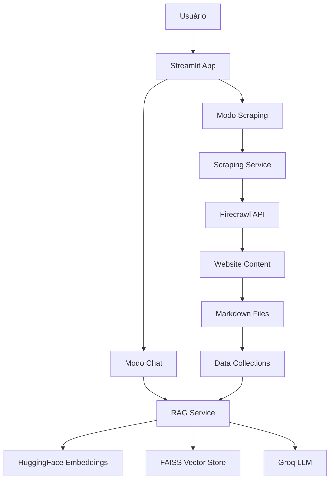

# 📚 AskTheDocs

<div align="center">


**Uma aplicação inteligente para interagir com documentação usando RAG (Retrieval-Augmented Generation)**

[](https://python.org)
[](https://streamlit.io)
[](https://langchain.com)
[](LICENSE)

</div>

## 🚀 Visão Geral

O **AskTheDocs** é uma aplicação web moderna que permite fazer perguntas inteligentes sobre documentação usando técnicas avançadas de IA. A aplicação combina **web scraping** para coletar documentação e **RAG (Retrieval-Augmented Generation)** para responder perguntas de forma contextual e precisa.

### ✨ Principais Funcionalidades

- 🔍 **Web Scraping Inteligente**: Extrai documentação de websites usando Firecrawl API
- 💬 **Chat com RAG**: Sistema de perguntas e respostas baseado em contexto
- 🎨 **Interface Moderna**: Design responsivo com suporte a temas claro/escuro
- 📁 **Gerenciamento de Coleções**: Organize diferentes documentações em coleções
- ⚡ **Processamento Rápido**: Usa Groq API para respostas rápidas
- 🔄 **Crawling Assíncrono**: Processa websites grandes de forma eficiente

## 🏗️ Arquitetura



## 🛠️ Tecnologias Utilizadas

### Frontend
- **Streamlit** - Framework web para Python
- **HTML/CSS** - Interface responsiva

### Backend
- **Python 3.8+** - Linguagem principal
- **LangChain** - Framework para aplicações LLM
- **FAISS** - Biblioteca de busca vetorial
- **HuggingFace** - Modelos de embeddings

### APIs Externas
- **Groq API** - LLM para geração de respostas
- **Firecrawl API** - Web scraping e crawling

### Outras Bibliotecas
- **python-dotenv** - Gerenciamento de variáveis de ambiente
- **requests** - Requisições HTTP
- **pathlib** - Manipulação de caminhos

## 📦 Instalação

### Pré-requisitos

- Python 3.8 ou superior
- Conta na [Groq API](https://console.groq.com/)
- Conta na [Firecrawl API](https://firecrawl.dev/)

### 1. Clone o repositório

```bash
git clone https://github.com/seu-usuario/askthedocs.git
cd askthedocs
```

### 2. Crie um ambiente virtual

```bash
python -m venv venv

# Windows
venv\Scripts\activate

# Linux/Mac
source venv/bin/activate
```

### 3. Instale as dependências

```bash
pip install -r requirements.txt
```

### 4. Configure as variáveis de ambiente

Crie um arquivo `.env` na raiz do projeto:

```env
# Groq API (obtenha em https://console.groq.com/)
GROQ_API_KEY=sua_chave_groq_aqui

# Firecrawl API (obtenha em https://firecrawl.dev/)
FIRECRAWL_API_KEY=sua_chave_firecrawl_aqui
FIRECRAWL_API_URL=https://api.firecrawl.dev
```

### 5. Execute a aplicação

```bash
streamlit run askthedocs/app.py
```

A aplicação estará disponível em `http://localhost:8501`

## 🚀 Como Usar

### 1. Modo Scraping

1. Acesse a aba **"Scraping"** no sidebar
2. Insira a URL da documentação que deseja processar
3. Digite um nome para a coleção
4. Clique em **"Iniciar scraping"**
5. Aguarde o processamento (pode levar alguns minutos)

### 2. Modo Chat

1. Acesse a aba **"Chat"** no sidebar
2. Selecione uma coleção de documentação
3. Faça perguntas sobre o conteúdo
4. Receba respostas contextuais e precisas

## 📁 Estrutura do Projeto

```
askthedocs/
├── 📁 askthedocs/           # Aplicação principal
│   ├── 📄 app.py            # Arquivo principal do Streamlit
│   ├── 📁 presentation/     # Interfaces de usuário
│   │   ├── 📄 chat.py       # Interface de chat
│   │   └── 📄 scraping.py   # Interface de scraping
│   └── 📁 assets/           # Recursos visuais
│       ├── 📄 logo_white.svg
│       └── 📄 logo_dark.svg
├── 📁 service/              # Serviços de backend
│   ├── 📄 rag.py           # Serviço RAG
│   └── 📄 scraping.py      # Serviço de scraping
├── 📁 data/                # Dados da aplicação
│   └── 📁 collections/     # Coleções de documentação
├── 📄 requirements.txt     # Dependências Python
├── 📄 .env.example        # Exemplo de variáveis de ambiente
└── 📄 README.md           # Este arquivo
```

## 🔧 Configuração Avançada

### Personalizando o Modelo de Embeddings

Para usar um modelo diferente de embeddings, edite `service/rag.py`:

```python
self.embeddings = HuggingFaceEmbeddings(
    model_name="seu-modelo-aqui"  # Ex: "sentence-transformers/all-MiniLM-L6-v2"
)
```

### Ajustando o LLM

Para usar um modelo diferente do Groq, edite `service/rag.py`:

```python
self.llm = ChatGroq(
    groq_api_key=os.getenv("GROQ_API_KEY"),
    model_name="seu-modelo-aqui"  # Ex: "llama3-8b-8192"
)
```

### Configurando o Tamanho dos Chunks

Ajuste o tamanho dos chunks de texto em `service/rag.py`:

```python
self.text_splitter = RecursiveCharacterTextSplitter(
    chunk_size=1000,      # Tamanho máximo de cada chunk
    chunk_overlap=200,    # Sobreposição entre chunks
)
```

## 🎨 Temas

A aplicação suporta temas claro e escuro automaticamente. O logo se adapta ao tema ativo:

- **Tema Claro**: Logo com cores vibrantes
- **Tema Escuro**: Logo com cores suaves

## 🤝 Contribuindo

Contribuições são bem-vindas! Para contribuir:

1. Faça um fork do projeto
2. Crie uma branch para sua feature (`git checkout -b feature/AmazingFeature`)
3. Commit suas mudanças (`git commit -m 'Add some AmazingFeature'`)
4. Push para a branch (`git push origin feature/AmazingFeature`)
5. Abra um Pull Request

## 📝 Licença

Este projeto está licenciado sob a Licença MIT - veja o arquivo [LICENSE](LICENSE) para detalhes.

## 👨‍💻 Autor

**Ailton Kupinski**

- GitHub: [@ailtonkupinski](https://github.com/ailtonkupinski)
- LinkedIn: [Ailton Kupinski](https://www.linkedin.com/in/ailton-fabio-kupinski/)

## 🙏 Agradecimentos

- [Streamlit](https://streamlit.io/) - Framework web incrível
- [LangChain](https://langchain.com/) - Framework para aplicações LLM
- [Groq](https://groq.com/) - API de LLM rápida e eficiente
- [Firecrawl](https://firecrawl.dev/) - API de web scraping
- [HuggingFace](https://huggingface.co/) - Modelos de embeddings

## 📊 Roadmap

- [ ] Suporte a mais formatos de arquivo (PDF, DOCX)
- [ ] Integração com mais provedores de LLM
- [ ] Sistema de cache para melhor performance
- [ ] Interface de administração
- [ ] Exportação de conversas
- [ ] Suporte a múltiplos idiomas

---

<div align="center">

**⭐ Se este projeto foi útil para você, considere dar uma estrela! ⭐**

</div>
